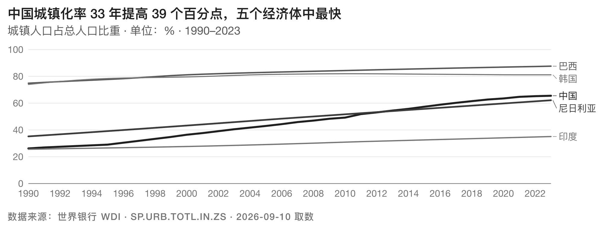
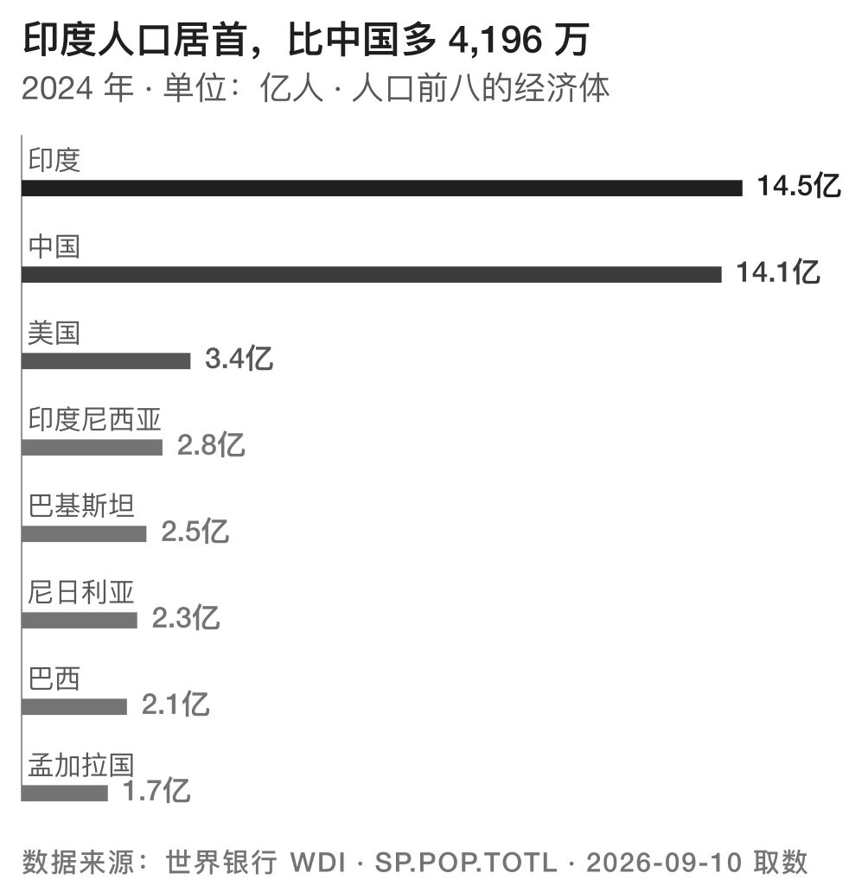
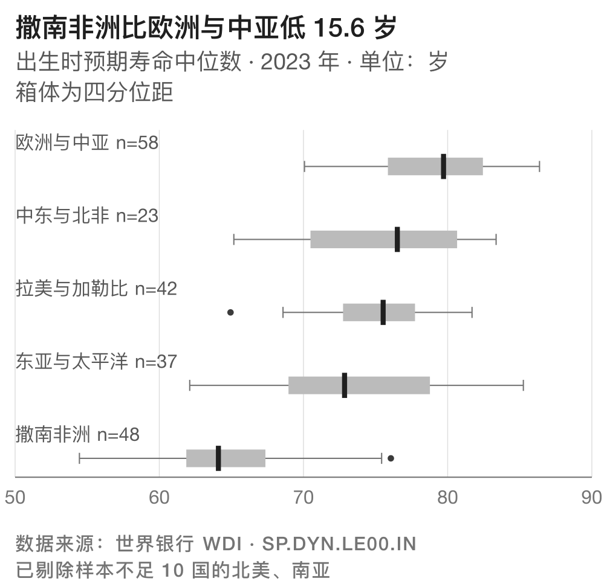
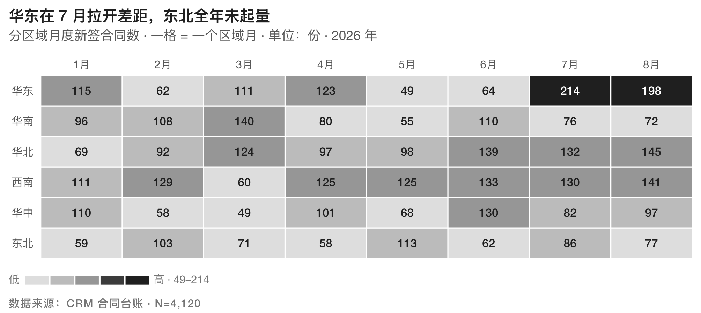
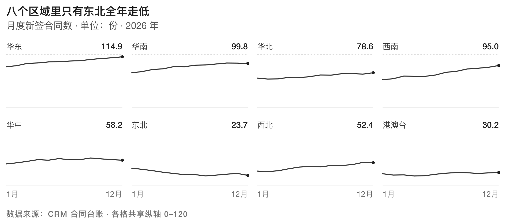
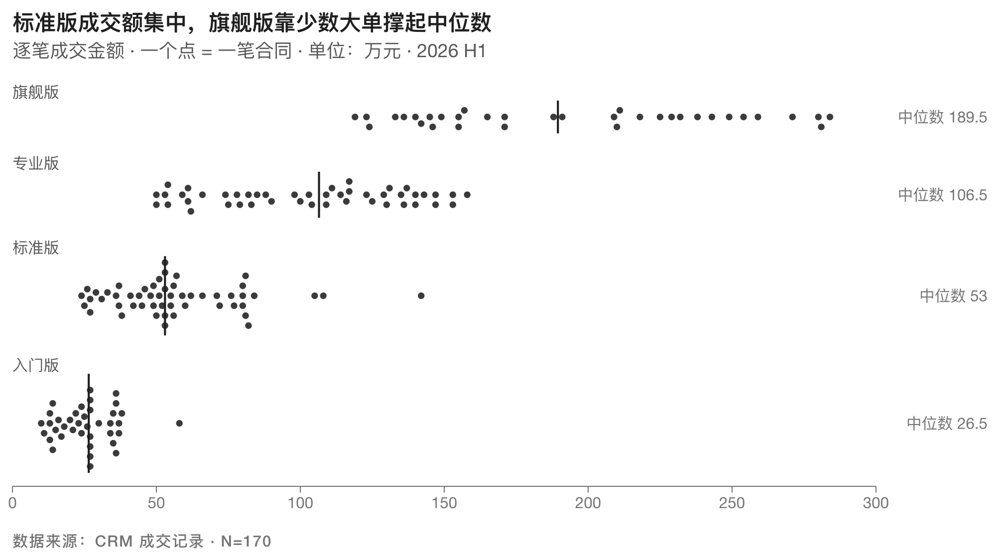

# Inkstone 砚台 · 印刷优先的中文图表库

[](https://github.com/wuzhenhua24/inkstone/actions/workflows/ci.yml)


[](LICENSE)
· English: [README.en.md](README.en.md)

以 **pt** 出图，宽度取自期刊栏宽，1:1 落纸。输出矢量 SVG / PDF / 300dpi PNG，
无 JavaScript 运行时，直接置入 Word、LaTeX、InDesign 和幻灯片。**零第三方依赖。**



上面这张是 `examples/ex3_urbanization.py` 的产物，数据来自世界银行 WDI。
注意图里那两行字——**带数字的结论标题**，和**自带指标编号与取数日期的来源行**。
这套四件套（图题 / 副题 / 来源行）缺一条，校验器就不放行。

## 快速开始

**用 Claude Code 的**——整个仓库就是一个 skill，`SKILL.md` 在根目录：

```bash
git clone https://github.com/wuzhenhua24/inkstone ~/.claude/skills/inkstone
```

skill 要整个目录，只拷 `SKILL.md` 不行：决策规则在 `SKILL.md`，图型索引在
`catalog.md`，取值在 `tokens.py`，校验器在 `scripts/validate.py`。

**当 Python 库用的**——纯标准库，不用装任何东西，把仓库放进 `sys.path` 即可：

```python
import sys; sys.path.insert(0, "/path/to/inkstone")   # 或者设 PYTHONPATH
from charts.rank_bars import rank_bars
from scripts.render import render

svg = rank_bars([("华东", 128), ("华北", 96), ("华南", 71)],
                title="华东最高，是华南的 1.8 倍",
                subtitle="2026 上半年 · 单位：万元",
                source="数据来源：内部财务", unit="万元")
render(svg, "mine", outdir=".")      # -> mine.svg + mine.pdf + mine.png@300dpi
```

**只想要这套规范的**——读 [SKILL.md](SKILL.md)（决策规则）和 [catalog.md](catalog.md)
（图型索引：数据形状 / 版心 / 类目上限 / 失效条件）。

交付前跑校验器，退出码就是闸门：

```bash
python3 scripts/validate.py out/*.svg
```

`0` 全部合规 · `1` 有不合格，或某份读不了 · `2` 没给参数——glob 匹配不到文件
就是这种情况，一张图都没有不该算通过。

PDF / PNG 导出需要 `brew install librsvg`（或 `apt install librsvg2-bin`）；
只要 SVG 的话什么都不用装。

> PyPI 上的 `inkstone` 是另一个项目（RCWA 电磁场求解器），与本项目无关。
> 本项目按目录分发，不上 PyPI。

## 长什么样

 

左边 R1 定序条、右边 D3 五数摘要，都是 85mm 单栏原尺寸——两张并排正好拼成一个
170mm 双栏。**栏宽档位这件事，图自己演示完了。**



M1 矩阵热力。深色格里的数字翻成纸白，而「这块底色到底盖没盖住这行字」是机器判的：
白字飘到白纸上，灰度审阅时看不见。





十三张图型见下面的[图型](#图型)一节；真实数据成品见 [examples/](examples/README.md)。

## 为什么不是又一个 HTML 图表库

屏幕图表库的约束是审美，印刷图表的约束是物理：

| | 屏幕图表 | Inkstone |
|---|---|---|
| 单位 | px，随 DPR 缩放 | **pt**，1:1 落纸 |
| 宽度 | 响应式 | **由栏宽决定**（85/114/170mm） |
| 中文字号 | 无下限意识 | **7.5pt 地板**，代码层强制 |
| 线宽 | 0.5px 发丝线很美 | **0.35pt 地板**，再细胶印会断 |
| 颜色 | 随便 | **CIE L\* 等距灰阶**，彩色档只换色相不换明度 |
| 动画 | 核心卖点 | 不存在 |
| 规范执行 | 靠自觉 + 拒绝清单 | **`scripts/validate.py` 机器判定** |

最后一行是关键：印刷约束客观可判定，所以规范可以真正被执行，而不是写在文档里等模型自觉。

## 快速开始

```bash
python3 demo.py && python3 scripts/validate.py out/*.svg
```

全套测试（CI 跑的就是这一条）：

```bash
python3 tests/run.py
```

零依赖（纯标准库）。PDF/PNG 导出需要 `brew install librsvg`。

## 测试查什么

| 组 | 检查 |
|---|---|
| 渲染 | 全部图型能画出来 |
| 校验 | 产物 / token / 目录全部合规 |
| 反例 | 校验器仍抓得住违规，命中数不少于预期——防止规则被悄悄改弱 |
| 选型 | `examples/` 每个例子都写了 3 个候选和淘汰理由，且理由要落到数据形状或 catalog 的失效条件上——SKILL.md 分量最重的一条要求，第一次有产物也第一次被判 |
| 闸门 | `validate.py` 的退出码本身要对：**不给参数必须失败**（glob 匹配不到文件就是零参数，照旧 exit 0 等于在「一张图都没有」时放行），坏文件不会中断整个循环 |
| 画廊 | `docs/gallery/` 里的 SVG 必须与当场重跑的产物字节一致（PNG 不断字节——跨 librsvg 版本会变）；README 的图链接和普通链接都要指向真实存在的文件 |
| 盲区 | 十三处定点突变（px 换 pt、viewBox 翻倍、条跑到纸外、点缩到地板下、混进渐变、描边灰度过近……），每处都必须被**对应的那条**规则点名。只数命中条数是不够的：删掉一条规则、另一条恰好多吐一条，总数不变 |
| 越界 | 七道类目上限都会拒绝超限数据，且**报错必须是这道守卫自己说的话**——只看抛没抛 ValueError，被别的守卫顶包也算过；R3 的每点当量随量级无上限地走 |
| 界内 | 恰好取到声明的上限那一档，十二处全都画得出来且合规——只测「超限被拒」的话，声明 ≤6 而第 6 条画不出来这种事没人会发现 |
| 数值 | 数值永不排成科学计数法（`:,g` 在 \|v\| ≥ 1e6 时会把营收印成「1.23457e+06」）；数字↔单位的边界有规则——数量级词紧贴（14.5亿）、量词留空（1,840 件）。此前是裸拼接，同一行来源里会同时出现「箱宽 5分钟」和「10 箱」 |
| 负值 | 长度编码的七张图拒绝负值；R2 分岔条照画不误 |
| 退化 | 十六处空输入全部友好拒绝；全等值样本仍要画得出来 |
| 留位 | 标签抽稀按实测宽度，退回字符数估宽会被校验器抓住 |
| 色板穿透 | 切色板后原语默认参数跟着走，不漏出 mono 灰 |
| 版心覆盖 | 13 张 × 5 档栏宽 = 65 种组合全部合规；图形区高度随栏宽增长 |
| 字宽估计 | 东亚歧义宽度字符在中文串里按整字身算（「·」实测差 3.6 倍） |
| 文档一致 | catalog 的上限声明、分区「待建」标记、README 的行数与图型表全部机器判 |
| 确定性 | **清空 out/ 后**跑两次，字节与产物清单都一致。不清空的话，上一次跑剩的文件会被算成本次产物——实测塞一份进去，全套照样绿并宣称「22 份两次渲染字节一致」 |
| 导出 | PDF / PNG 真的产出且不是空白页；PNG 带 300dpi 分辨率块，像素数与版心宽度对得上（缺了这 9 个字节，Word 会按 72dpi 把 85mm 的图置入成 354mm） |
| 目录闭环 | catalog 每个编号都有实现、标记块和渲染产物 |
| 灰度等价 | 13 张 × 3 套色板 = 39 组，逐处用色的明度与 mono 版一致（实测最大偏差 0.4 L\*）。现场渲染，不依赖 `out/pal-*.svg` 存在 |

三十条失败路径都验证过真的会失败。原有五条：削弱校验器、引入随机数、把热力档位
改回死区、catalog 声明不存在的实现、色板明度偏离阶梯。

后加的二十五条：把原语的颜色默认参数写回函数签名（切色板后会漏出 mono 灰）·
撤掉 R1 的负值守卫 · 撤掉空数据守卫 · 把标签抽稀退回按字符数估宽 ·
把灰度判定退回只比文档里相邻的两个色 · 撤掉四件套校验 · 把图形区高度写回
硬编码常数 · 在 PLOT_ASPECT 里留一个没人调用的档 · 撤掉 D1 首尾箱边的锚点 ·
撤掉 R2 的类目上限 · 在 catalog 里抹掉一处「代码强制」· 抠掉 PNG 的 pHYs 分辨率块 ·
把数值格式化退回 `:,g`（营收就成了「1.23457e+06」）· 撤掉校验器的科学计数法判定 ·
把 R3 的每点当量退回查表（超出最大档就回落到 1，160 万的输入照单全收）·
把 S2 的线宽表改到末两档撞车（catalog 声明的第 6 条线当场画不出来）·
撤掉几何包围盒判定（跑到纸外的条从此零告警）· 撤掉图高判定（443mm 的单栏图照过）·
把 stroke 撤出灰度两两判定（S1/S2/D1 的数据色从此不被检查）·
撤掉 C1 的格子封顶（幻灯片档格子长到 11mm，整图 157mm 塞不进一张 16:9）·
把交付闸门退回「不给参数也 exit 0」· 撤掉坏文件的兜底（一份读不了就中断整个循环，
后面几十份一份没查，而退出码非零看着像拦下了什么）· 让一道上限守卫失效
（抛出的不再是它自己的话，而是别的守卫顶包、甚至裸 IndexError）。

## 结构

```
SKILL.md            # 决策规则，111 行
catalog.md          # 图型索引：数据形状 / 版心 / 类目上限 / 失效条件 / 实现位置
tokens.py           # 唯一取值来源：版心、字号、灰阶、线宽、字体栈
palettes.py         # 彩色档：色相可换，L* 不可换
charts/_color.py    # sRGB ↔ CIELAB、色盲模拟
charts/_svg.py      # SVG 原语 + 中西文混排宽度实测
charts/*.py         # 图型实现，每张带 # ════ 编号 图名 ════ 标记块
scripts/render.py   # SVG → PDF / PNG@300dpi
scripts/validate.py # 印刷规范校验器
examples/           # 真实数据成品三张 + 可重跑的取数脚本
```

## 图型

| # | 名字 | 数据形状 | 版心 |
|---|---|---|---|
| R1 | 定序条 | 类目 → 单一数值，需读出高低次序 | 85mm 单栏 |
| R2 | 分岔条 | 类目 → 可正可负的数值，≤10 项 | 85mm 单栏 |
| R3 | 点阵瀑布 | 类目 → 可数的整数量 | 85mm 单栏 |
| S1 | 日序条码 | 每天一个读数，60–120 天 | 170mm 双栏 |
| S2 | 细线族 | 3–6 条序列同轴比较 | 170mm 双栏 |
| S3 | 小倍数网格 | 多实体各自一条序列，≤12 格 | 170mm 双栏 |
| C1 | 百格方阵 | 100% 构成，≤6 类 | 85mm 单栏 |
| C2 | 堆叠带 | 构成随时间变化，≤5 层 | 170mm 双栏 |
| D1 | 阶梯直方 | 单变量连续分布 | 85mm 单栏 |
| D2 | 蜂群 | 逐条记录的分布，40–180 点，≤6 组 | 170mm 双栏 |
| D3 | 五数摘要 | 分位数 + 异常值，≤8 组 | 85mm 单栏 |
| M1 | 矩阵热力 | 两个离散维度 × 数值，≤100 格 | 170mm 双栏 |
| M2 | 散点带回归 | 两个连续变量是否共变 | 85mm 单栏 |

数据形状、类目上限和失效条件见 `catalog.md`。

## 彩色档

```python
with T.use("indigo"):        # indigo 靛青 / ochre 赭石 / celadon 青瓷
    svg = rank_bars(DATA, ...)
```

每套色板都是把灰阶的七级明度原样搬到某个色相上——**彩色图影印成黑白后，
和 mono 版是同一张**。研报和期刊大量被黑白影印，色板不守这条，出版环节
就会毁掉它。这条约束顺带解决了色盲安全：单色相 + 明度阶梯不依赖色相辨别，
三种色盲模拟下相邻级仍差 ≥10 L\*。

```bash
python3 demo_palettes.py     # 出各色板样张
```

## 校验器查什么

**产物 · 尺寸**：宽高是否**以 pt 为单位**（`240.945px` 剥掉单位后和 `240.945pt` 是同一个数字，
落纸尺寸却差 4.17 倍）· viewBox 是否与宽高 1:1（一旦不等比，下面每一条按 pt 算的判定
全部作废）· 栏宽是否在版心表内 · **图高是否超过该载体的页面高度**（此前只读 width、
从不读 height，一张 443mm 高的单栏图零告警通过）

**产物 · 图形**：**几何是否落在版心内**——rect / circle / line / path 逐个算包围盒。
此前除一条全局线宽地板外，非文字图元的几何一条都没判过：跑到纸外的条、
被吞成零长的条，全部零告警通过，而图形才是这张图的主体 ·
点半径是否低于印刷地板 · 线宽地板 · 有无光栅图 / 渐变 / 滤镜 / 图案 / 蒙版 / 动画
（按标签名逐个点名，不靠一条 `<image\b` 正则）· `fill="url(#…)"` 这类从属性侧
混进来的渐变 · 透明度是否低于 0.15（这么淡的网点胶印落不上纸；alpha 表达密度是
屏幕的做法，纸上该改半径或改空心点）

**产物 · 文字**：CJK/拉丁字号下限 · 文本出血（按实测宽度算）· 文字对纸对比度 ≥4.5:1 ·
数据色**两两**灰阶 ≥10 L\*（fill 和 stroke 都收——S1/S2/D1 的数据全编码在描边上，
只收 fill 等于这三张从没进过这条判定）· 同一基线上的文字互不压字 ·
四件套（图题 / 副题 / 来源行）是否齐全 · 文字是否误用填充档灰 · 字体栈是否有 CJK 兜底 ·
深色块上的文字是否真被那块底色盖住（白字飘到白纸上，灰度审阅看不见）·
数值有没有排成科学计数法

**目录**：声明张数 vs 实际实现数 · 每条目指向的文件是否存在 · 是否带 `# ════` 标记块 ·
「类目上限」列里写了数字的，是否都标了「代码强制」并真的由代码拦住 ·
分区标题是否还挂着「待建」而底下已经有实现

**README 自身**：结构块里「N 行」的声明是否属实 · 图型表的行数是否等于 catalog 声明的张数 ·
CI 徽标指向的 workflow 文件是否存在（徽标坏掉不报错，只会永远显示一张
「workflow not found」的灰图，而所有人都只当它是还没跑完）

**token 自身**：热力档位是否落进 L\*50–56 死区（两种文字色都不合格的灰）·
灰阶相邻两级是否 ≥10 L\* · 文字安全档是否真的对纸 ≥4.5:1 ·
字号档是否低于 CJK 下限（低了会被静默抬高，按原值算的宽度全部偏小）·
`PLOT_ASPECT` 里有没有没人调用的档（没有调用点的 token 不受任何测试保护，
上一版的 `RATIO` 就是这么和现实脱节的）

## 路线

- [x] 第 1 周 · 定调：tokens + R1 定序条 + 校验器闭环
- [x] 十三张，覆盖比较/排序、时间序列、构成、分布、关系五个族
- [x] CI：GitHub Actions，Python 3.9 / 3.13 双版本
- [x] 彩色档：三套 L\* 锁定色板，灰度等价与色盲安全均有测试守护
- [x] 五档栏宽全部纳入测试（此前只跑过 single / double 两档）
- [x] 文档声明全部机器判：catalog 的上限与「待建」标记、README 的行数与图型表
- [x] examples/ 三张真实数据成品（世界银行 WDI），选型过程机器判定
- [x] 受众开门：第一屏放成品图、双语入口、三路安装说明、GitHub About 与 topics

## 许可

[MIT](LICENSE)。模板代码为独立实现，未使用任何第三方图表库的代码。
